## js中的几种循环的区别

- forEach遍历

只是简单的遍历，没有返回值，不改变原有数组。有三个参数，分别是元素，下标，数组。
<div align=center>
  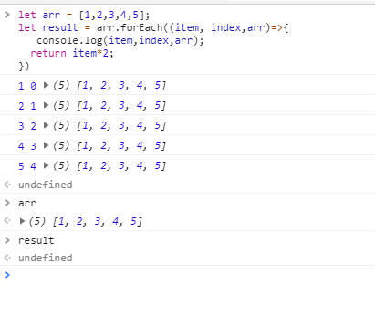
</div>

- map循环

有返回值，不改变原有数据。有三个参数，同forEach。
<div align=center>
  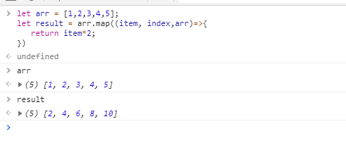
</div>

- reduce

主要是为了对所有数组进行累加，最后返回一个值，不改变原数组,参数：累加的函数，传给数组的初始值。
<div align=center>
  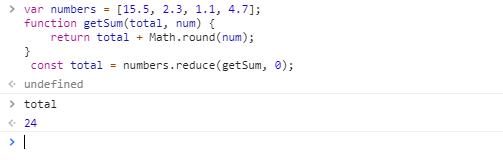
</div>

- filter

filter()过滤，返回满足条件的元素，不改变原数组,有三个参数，同forEach。
<div align=center>
  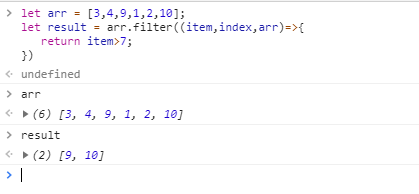
</div>

- find

find()函数 就是只要找到第一个满足条件的就返回。不改变原数组,有三个参数，同forEach。
<div align=center>
  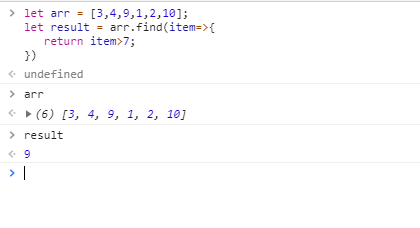
</div>

- every

every()是对数组中每一项运行给定函数，如果该函数对每一项返回true,则返回true，遇到第一个不满足的返回false，跳出循环。
<div align=center>
  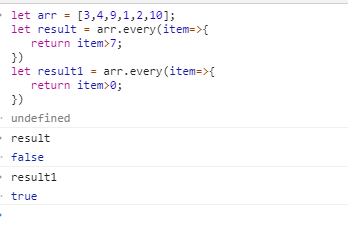
</div>

- some

some()是对数组中每一项运行给定函数，如果该函数对任一项返回true，则返回true,并跳出循环。
<div align=center>
  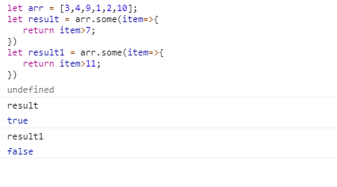
</div>

- concat() 方法用于连接两个或多个数组。该方法不会改变现有的数组，仅会返回被连接数组的一个副本。
<div align=center>
  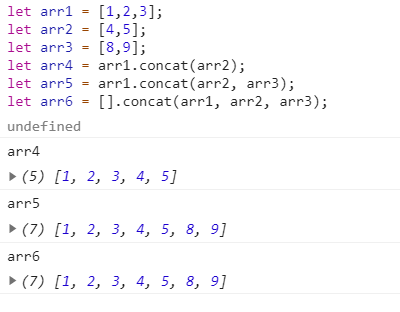
</div>

- join() 用于把数组中的所有元素放入一个字符串。元素是通过指定的分隔符进行分隔的，默认使用","号分割，不改变原数组。
<div align=center>
  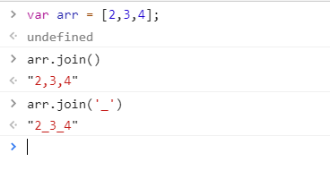
</div>

- push() 可向数组的末尾添加一个或多个元素，并返回新的长度。末尾添加，返回的是长度，会改变原数组。
<div align=center>
  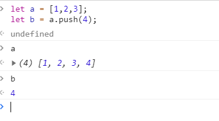
</div>

- pop()方法用于删除并返回数组的最后一个元素。返回最后一个元素，会改变原数组。
<div align=center>
  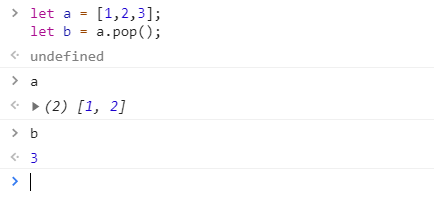
</div>

- shift() 用于把数组的第一个元素从其中删除，并返回第一个元素的值。返回第一个元素，改变原数组。
<div align=center>
  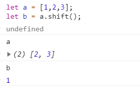
</div>

- unshift() 用于可向数组的开头添加一个或更多元素，并返回新的长度。返回新长度，改变原数组。
<div align=center>
  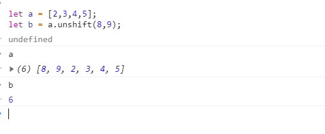
</div>

- slice() 返回一个新的数组，包含从start(若是负数，则从末尾开始。-1倒数第一个，-2倒数第2个)到end（不包括该元素，若未被规定，则会选取从start到数组结尾的所有元素）的arrayObject中的元素。返回选定的元素，该方法不会修改原数组。
<div align=center>
  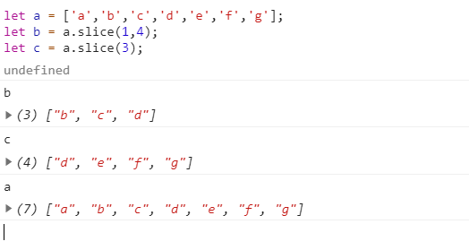
</div>

- splice() 方法向/从数组中添加/删除项目，然后返回被删除的项目。会改变原始数组。
```javascript 
arrayObject.splice(index, howmany,item1,....,itemX);
// index 必须。整数，规定添加/删除项目的位置，使用负数可从数组结尾处规定位置。
// howmany 必须。要删除的项目数量。如果设置为0，则不会删除项目。
// item1,....,itemX 可选。向数组添加的新项目。
```
<div align=center>
  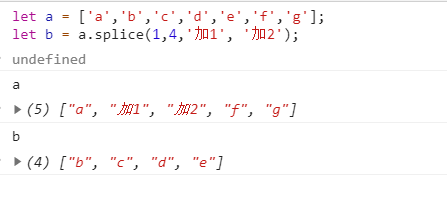
</div>

- substring()和substr()
* 相同点：如果只是写一个参数，两者的作用都一样，都是截取字符串从当前下标以后知道字符串最后的字符串片段。
* 不同点：1. substr(start, length):第二个参数是截取字符串的长度(从起始点截取某个长度的字符串)；2. substring(start,end);第二个参数是截取字符串最终的下标(截取2个位置直接的字符串，含头不含尾)
<div align=center>
  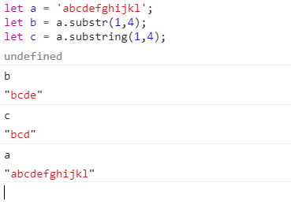
</div>

- sort排序 默认升序

- reverse()用于颠倒数组中元素的顺序。返回的是颠倒后的数组，会改变原数组。
<div align=center>
  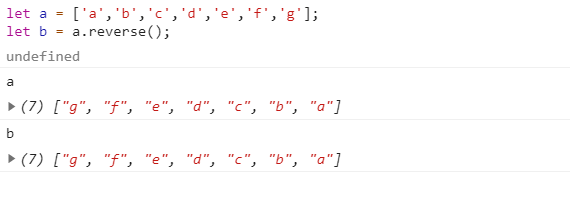
</div>

- indexOf()和lastIndexOf() 
```javascript
// searchvalue 必须。规定需检索的字符串值
// fromindex 可选的整数参数。规定在字符串中开始检索的位置。它的合法取值是0到stringObject.length - 1。如省略该参数，则将从字符串的首字符开始检索。
stringObject.indexOf(searchvalue,fromindex)

```
<div align=center>
  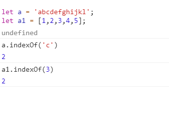
</div>

- split() 方法用于把一个字符串分割成字符串数组。
```javascript
// separator 必需。字符串或正则表达式，从该参数指定的地方分割 stringObject。
// howmany  可选。该参数可指定返回的数组的最大长度。如果设置了该参数，返回的子串不会多于这个参数指定的数组。如果没有设置该参数，整个字符串都会被分割，不考虑它的长度。
stringObject.split(separator,howmany)
```
<div align=center>
  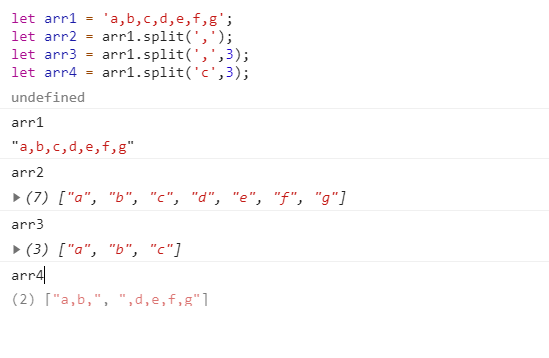
</div>