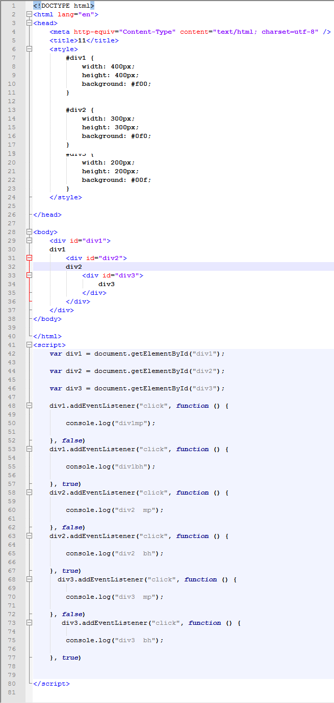

## js中的几种循环的区别

- forEach遍历

只是简单的遍历，没有返回值，不改变原有数组。有三个参数，分别是元素，下标，数组。

  

- map循环

有返回值，不改变原有数据。有三个参数，同forEach。

  

- reduce

主要是为了对所有数组进行累加，最后返回一个值，不改变原数组,参数：累加的函数，传给数组的初始值。

  

- filter

filter()过滤，返回满足条件的元素，不改变原数组,有三个参数，同forEach。

  

- find

find()函数 就是只要找到第一个满足条件的就返回。不改变原数组,有三个参数，同forEach。

  

- every

every()是对数组中每一项运行给定函数，如果该函数对每一项返回true,则返回true，遇到第一个不满足的返回false，跳出循环。

  

- some

some()是对数组中每一项运行给定函数，如果该函数对任一项返回true，则返回true,并跳出循环。

  

## for...in, for...of,   (let i = 0;i<length;i++)的区别

## 捕获和冒泡

 非当前点击元素先捕获再冒泡，对于当前的点击元素，则按照捕获和冒泡的书写顺序来执行
 addEventListener  第三个参数 true 捕获  false 冒泡，默认是冒泡

  

  

