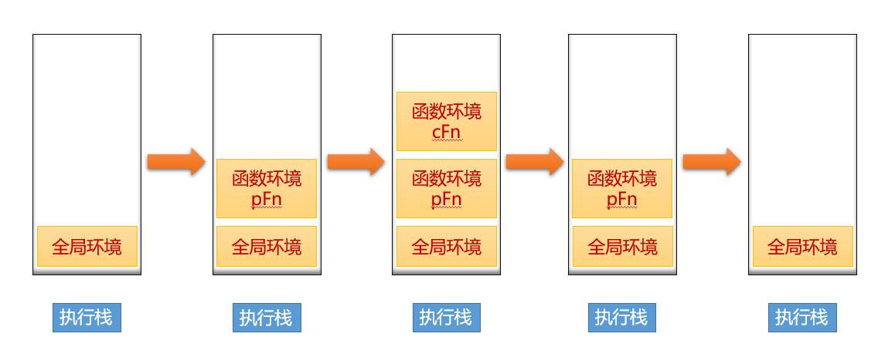

## 执行上下文和执行栈

* 执行上下文就是当前Javascript代码被解析和执行时所在得环境得抽象概念,Javascript中运行的任何代码都是再执行上下文中运行.
* 执行上下文的生命周期包括三个阶段：创建阶段→执行阶段→回收阶段，我们重点介绍创建阶段。

创建阶段（当函数被调用，但未执行任何其内部代码之前）会做以下三件事：

   1. 创建变量对象：首先初始化函数的参数arguments，提升函数声明和变量声明。

   2. 创建作用域链

   3. 确定this指向

```javascript
function test(arg){
// 1. 形参 arg 是 "hi"
// 2. 因为函数声明比变量声明优先级高，所以此时 arg 是 function
console.log(arg);
var arg = 'hello'; // 3.var arg 变量声明被忽略， arg = 'hello'被执行
function arg(){
　　console.log('hello world')
}
console.log(arg);
}
test('hi');
/* 输出：
function arg() {
　　console.log('hello world');
}
hello
*/
```
这是因为当函数执行的时候,首先会形成一个新的私有的作用域，然后依次按照如下的步骤执行：

1. 如果有形参，先给形参赋值

2. 进行私有作用域中的预解释，函数声明优先级比变量声明高，最后后者会被前者所覆盖，但是可以重新赋值

3. 私有作用域中的代码从上到下执行
<div align=center>
  
</div>

从上面的流程图，我们需要记住几个关键点：

1. JavaScript执行在单线程上，所有的代码都是排队执行。
2. 一开始浏览器执行全局的代码时，首先创建全局的执行上下文，压入执行栈的顶部。
3. 每当进入一个函数的执行就会创建函数的执行上下文，并且把它压入执行栈的顶部。当前函数执行完成后，当前函数的执行上下文出栈，并等待垃圾回收。
4. 浏览器的JS执行引擎总是访问栈顶的执行上下文。
5. 全局上下文只有唯一的一个，它在浏览器关闭时出栈。

## 作用域与作用域链
ES6 到来JavaScript 有全局作用域、函数作用域和块级作用域（ES6新增）。

我们可以这样理解：作用域就是一个独立的地盘，让变量不会外泄、暴露出去。也就是说作用域最大的用处就是隔离变量，不同作用域下同名变量不会有冲突。

### 函数作用域：顾名思义就是在这个函数体里边才能访问的变量；当然可以利用闭包来实现跨区域访问局部作用域的变量；

### 块级作用域：ES6新增，用let命令新增了块级作用域，外层作用域无法获取到内层作用域，非常安全明了。即使外层和内层都使用相同变量名，也都互不干扰；

```javascript
function F1() {
　　var a = 100
　　return function () {
　　　　console.log(a)
　　}
}
function F2(f1) {
　　var a = 200
　　console.log(f1())
}
var f1 = F1()
F2(f1) // 100
```
上述代码中，自由变量a的值，从函数F1中查找而不是F2,这是因为当自由变量从作用域链中去寻找，依据的是函数定义时的作用域链，而不是函数执行时。

那么自由变量的值如何得到 ？  ——  向父级作用域 (创建该函数的那个父级作用域)寻找。

如果父级也没呢？再一层一层向上寻找，直到找到全局作用域还是没找到，就宣布放弃。这种一层一层的关系，就是作用域链 。