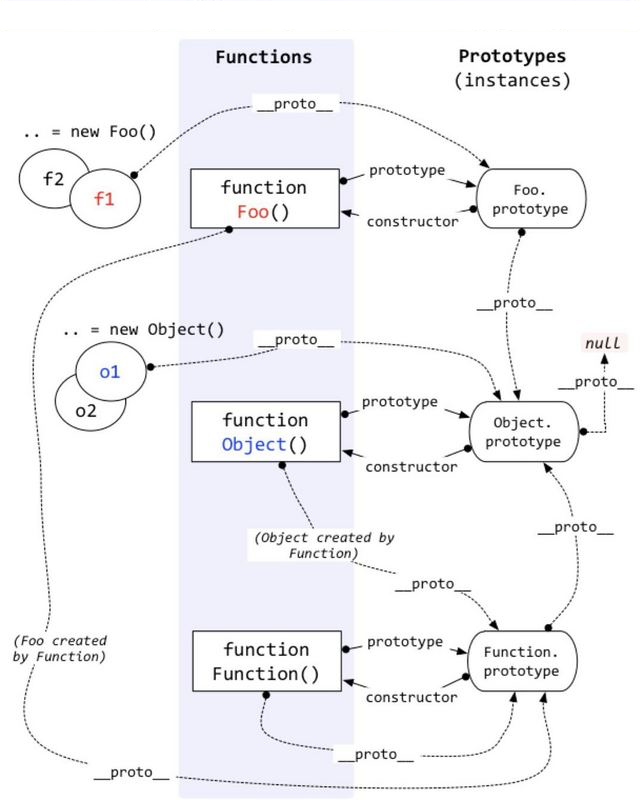

# 原型链
<div align=center>
  
</div>


# 实现instanceOf
```javascript
/**
 * 
 * @param {string} L 左表达式
 * @param {string} R 右表达式
 */
function dInstanceof(L, R){
  const O = R.prototype;
  L = L._proto_;
  while(true){
    if(L === null) return false;
    if(O === L) return true;
    L = L._proto_;
  }
}
```
# 实现new
```javascript
/**
 * 模拟new
 * 1.创建一个全新的对象
 * 2.会被执行[[Prototype]](也就是proto)链接
 * 3.使this指向新创建的对象
 * 4.通过new创建的每个对象将最终被[[Prototype]]链接到这个函数的prototype对象上
 * 5.如果函数没有返回对象类型Object（包含Function,Array,Date,RegExp,Error）,那么new表达式中的函数调用将返回该对象的引用
 *  */
function dNew(){
  const obj = new Object();
  const Constructor = [].shift.call(arguments);
  obj._proto_ = Constructor.prototype;
  const ret = Constructor.apply(obj, arguments);
  return typeof ret === 'object' ? ret : obj;
}
```
# 寄生组合继承
```javascript
// 寄生组合继承
function Sup(){
  this.name = 'Sup';
  this.color = 'red';
}
Sup.prototype.getColor = function(){
  console.log(this.color)
}
function Sub(){
  Sup.call(this);
  this.name = 'sub';
  this.age = 1;
}
Sub.prototype = Object.prototype(Sup.prototype);
Sub.prototype.Constructor = Sub;
Sub.prototype.getAge = function(){
  console.log(this.age)
}
```