# 冒泡排序

## 原理

比较任何两个相邻的项，如果第一个比第二个大，则交换它们。元素项向上移动至正确的顺序，就好像气泡升至表面一样，冒泡排序因此得名。

## 图解

以数组[8,9,2,5,7]为例

- 第一次循环：此次循环的多次比较交换，使最大的数字9冒在最下面
<div align=center>
  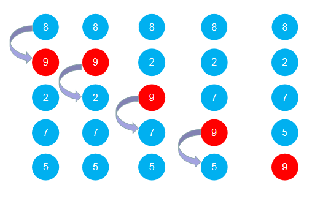
</div>

- 第二次循环：此次循环中的多次比较和交换，使8往下冒，最终排到倒数第二个位置。

<div align=center>
  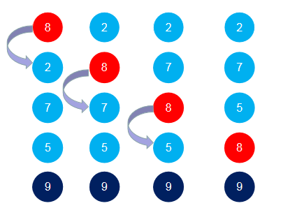
</div>

可以看到这个这次循环比第一次少一层循环
这是因为第一次循环时已经把最大的9排到最下面的位置了，这次排序肯定不会去占用最上面的位置的，所以此时比较次数可以比前面少一次。

- 第三次循环：同理，此时7会往下冒。比较次数同理又会比前面少一次。
<div align=center>
  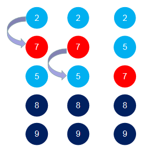
</div>

- 第四次循环： 5已经排在2的下面了，比较后不交换。
<div align=center>
  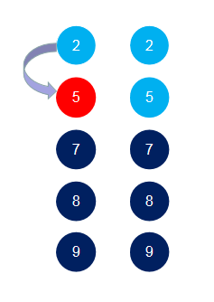
</div>

## 代码实现

以上总共实现了两次循环，以数组的长度为leng

第一层循环 ```javascript for(let i = 0; i < leng-1; i++) ```

第二层循环 ```javascript for(let j = 0; j < leng-i-1; j++)```

```javascript
    function sort(arr) {
      const leng = arr.length;
      for (let i = 0; i < leng - 1; i++) {  
        for (let j = 0; j < leng - i - 1; j++) { 
          if (arr[j] > arr[j + 1]) {
              const swap = arr[j];
              arr[j] = arr[j + 1];
              arr[j + 1] = swap;
            }
        }
      }
      return arr;
    }
```

# 选择排序

## 原理

选择排序算法是一种原址比较排序算法。选择排序大致的思路是找到数据结构中的最小值并将其放置在第一位，接着找到第二小的值并将其放在第二位，以此类推。

## 图解

* 假定未排序数组中，第一个数为最小

<div align=center>
  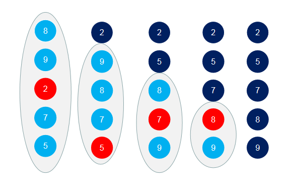
</div>

## 代码实现

```javascript
    function sort(arr) {
        const leng = arr.length;
        for (let i = 0; i < leng - 1; i++) {
            let min = arr[i];
            let pos = i;
            for (let j = i + 1; j < leng; j++) {
                if (arr[j] < min) {
                    min = arr[j];
                    pos = j;
                }
            }
            if(pos!==i){
                arr[pos] = arr[i];
                arr[i] = min;
            }
        }
        return arr;
    }
```

# 插入排序

## 原理

插入排序每次排一个数组项，以此方式构建最后的排序数组。假定第一项已经排序了，接着，它和第二项进行比较，第二项是应该待在原位还是插到第一项之前呢？这样，头两项就已正确排序，接着和第三项比较（它是该插入到第一、第二还是第三的位置呢？），以此类推。

将一个元素插入到其它已经有序的牌中的适当位置，因此其他所有元素在插入之前都向右移动一位，为新元素腾出空间

## 图解

- 第一次循环 第一个数已经是自然的有序数，前面无任何数了，所以不需要比较，我们拿第二个数开始比较，9与在它前面的是进行比较，8<9。在8前面已经没有数据了，第一次比较完毕，9的位置还是赋值9；

<div align=center>
  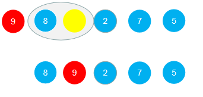
</div>

- 第二次循环 

经过第一次循环，[8,9]已经是有序数列了，从第3个数开始，与其前面的数进行对比；2<9,9往后移动一位，2<8,8往后移动一位，此时前面已无元素，2插入到第一位

<div align=center>
  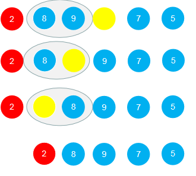
</div>

- 第三次循环

经过第二次循环，[2,8,9]一级是有序数列了，从第四个数开始；7<9,9往后移动一位，7<8,8往后移动一位，7>2,不移动，7插入在8的位置；

<div align=center>
  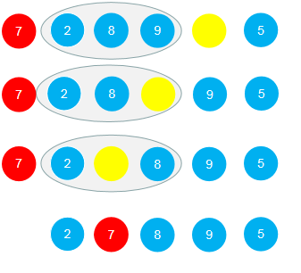
</div>

- 第四次循环

<div align=center>
  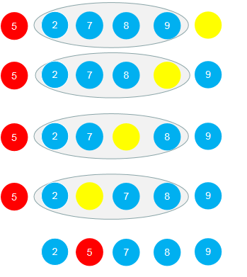
</div>


## 代码实现

```javascript
    function sort(arr) {
        const leng = arr.length;
        for (let i = 1; i < leng; i++) {
            let temp = arr[i];
            let j = i;
            while (j > 0 && arr[j - 1]> temp) {
                arr[j] = arr[j - 1];
                j--;
            }
            arr[j] = temp;
        }
        return arr;
    }
```
# 希尔排序

## 原理

希尔排序是按一定的间隔对数列进行分组，然后在每一个分组中做插入排序；随后逐次缩小间隔，在每一个分组中做插入排序...直到间隔等于1，做一次插入排序后结束。通常我们去取初始间隔为数列长度的一半：gap = length/2，以 gap = gap/2 的方式缩小;

## 图解

* (1) 首先取间隔为 gap = length/2 = 4，将数组分为如下的4组，对每一组实施插入排序：
<div align=center>
  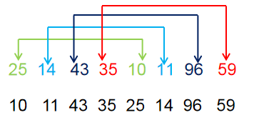
</div>

* (2) 接着继续分组，gap = gap/2 = 2，对每一组实施插入排序：
<div align=center>
  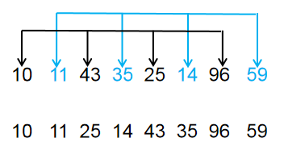
</div>

* (3) 继续对数组分组，gap = gap/2 = 1，即所有元素组成一组，做插入排序完成算法：
<div align=center>
  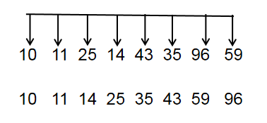
</div>

## 代码实现

```javascript
function sort(arr) {
    for (let gap = Math.floor(arr.length / 2); gap > 0; gap = Math.floor(gap / 2)) {
        // 内层循环与插入排序的写法基本上一直，每次移动的步长变成了gap
        for (let i = gap; i < arr.length; i++) {
            let temp = arr[i];
            let j = i;
            while (j > 0 && arr[j - gap]> temp) {
                arr[j] = arr[j - gap];
                j = j - gap;
            }
            arr[j] = temp;
        }
    }
    return arr;
}
```

# 归并排序

## 原理

其思想是将原始数组切分成较小的数组，直到每个小数组只有一个位置，接着将小数组归并成较大的数组，直到最后只有一个排序完毕的大数组。(分治)

## 图解

<div align=center>
  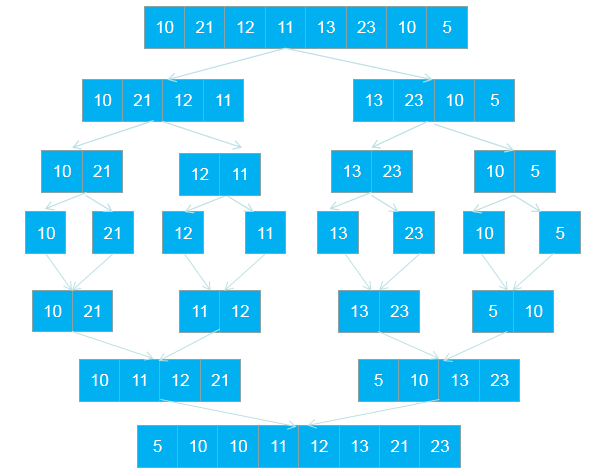
</div>

## 代码实现

```javascript
      const merge = function (left, right) {
        const result = [];
        let il = 0;
        let ir = 0;
        while (il < left.length && ir < right.length) {
          if (left[il] < right[ir]) {
            result.push(left[il]);
            il++;
          } else {
            result.push(right[ir]);
            ir++;
          }
        }
        while (il < left.length) {
          result.push(left[il]);
          il++;
        }
        while (ir < right.length) {
          result.push(right[ir]);
          ir++;
        }
        return result;
      };
      const merageSort = function (arr) {
        const length = arr.length;
        if (length === 1) return arr;
        const mid = Math.floor(length / 2); // Math.floor向下取整
        const left = arr.slice(0, mid);
        const right = arr.slice(mid, length);
        return merge(merageSort(left), merageSort(right));
      };
```

# 快速排序

## 原理
* （1）在数据集之中，选择一个元素作为"基准"（pivot）。

* （2）所有小于"基准"的元素，都移到"基准"的左边；所有大于"基准"的元素，都移到"基准"的右边。

* （3）对"基准"左边和右边的两个子集，不断重复第一步和第二步，直到所有子集只剩下一个元素为止。

## 图解

* (1) 以35为基数，按照顺序，将每个元素与"基准"进行比较，形成两个子集；大于的在右边，小于的在左边

<div align=center>
  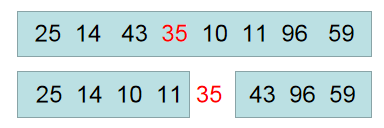
</div>

* (2) 左边的以14为基数，右边的以96为基数，重复步骤1

<div align=center>
  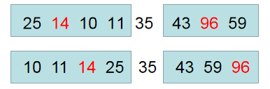
</div>

* (3) 重复步骤1，直到所有子集只剩下一个元素为止

<div align=center>
  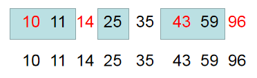
</div>

## 代码实现

```javascript
    function sort(arr) {
      if (arr.length <= 1) return arr;
      const pivotIndex = Math.floor(arr.length / 2);
      const pivot = arr.splice(pivotIndex, 1)[0];
      const left = [];
      const right = [];
      for (let i = 0; i < arr.length; i++) {
        if (arr[i] < pivot) {
          left.push(arr[i]);
        } else {
          right.push(arr[i]);
        }
      }
      return sort(left).concat([pivot], sort(right));
    }
```

# 堆排序

## 原理

* (1) 将无需序列构建成一个堆，根据升序降序需求选择大顶堆或小顶堆;

* (2) 将堆顶元素与末尾元素交换，将最大元素"沉"到数组末端;

* (3) 重新调整结构，使其满足堆定义，然后继续交换堆顶元素与当前末尾元素，反复执行调整+交换步骤，直到整个序列有序。

## 图解

* 原文动画出自：https://www.ee.ryerson.ca/~courses/coe428/sorting/heapsort.html
  <div align=center>
  
  </div>

## 代码实现

```javascript
let len;
function buildHeap(arr) {
    len = arr.length;
    for (let i = Math.floor(len / 2) - 1; i >= 0; i--) { // 建堆  叶的左节点为2i+1,右节点为2i+2
        adjustment(arr, i)
    }
}
function adjustment(arr, i) {
    let largeIndex = i;
    let left = 2 * i + 1;
    let right = 2 * i + 2;
    if (left < len && arr[left] > arr[largeIndex]) {
        largeIndex = left;
    }
    if (right < len && arr[right] > arr[largeIndex]) {
        largeIndex = right;
    }
    if (largeIndex !== i) {  // 即有一个叶子节点大于叶节点
        swap(largeIndex, i , arr);
        adjustment(arr, largeIndex);
    }
}
function swap (i, j, arr){
    let temp = arr[j];
    arr[j] = arr[i];
    arr[i] = temp;
}
function sort(arr){
    buildHeap(arr);
    for(let i = arr.length - 1; i > 0; i--){
        swap(0, i, arr);
        len --;
        adjustment(arr, 0);
    }
    return arr;
}
```
 
 # 计数排序

 ## 原理

计数排序的基本思想是对于给定的输入序列中的每一个元素x，确定该序列中值小于x的元素的个数。一旦有了这个信息，就可以将x直接存放到最终的输出序列的正确位置上。

例如，如果输入序列中只有17个元素的值小于x的值，则x可以直接存放在输出序列的第18个位置上。当然，如果有多个元素具有相同的值时，我们不能将这些元素放在输出序列的同一个位置上。解决方案就是要反向填充目标数组，以及将每个数字的统计减去1。

## 图解

* 找到最大的元素

* 用来存值的数组，下标在0到最大值范围，且把这个数组先填充0

* 取值，存值的数组中，不为0的元素，取其下标，有几个，就输出几次下标

<div align=center>
  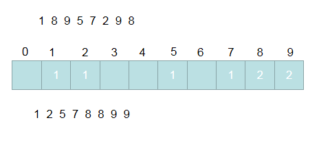
</div>

## 代码实现

```javascript
function sort(arr) {
    //先找出最大值
    let maxValue = 0;
    for (let i = 0; i < arr.length; i++) {
        maxValue < arr[i] ? maxValue = arr[i] : null;
    }
    //建造一个下标为0-maxValue的顺序数组；此数组的长度是maxValue+1
    let maxLength = maxValue + 1;
    let temp = [];
    let zArr = [];
    // 创建一个长度为maxLength的数组，元素为0
    for (let i = 0; i < maxLength; i++) {
        temp[i] = 0;
    }
    // temp数组填充
    for (let i = 0; i < arr.length; i++) {
        temp[arr[i]]++;
    }
    // 取值
    for(let i = 0; i < maxLength; i++){
        while(temp[i]!=0){
            zArr.push(i);
            temp[i]--;
        }
    }
    return zArr;
}
```

# 桶排序

## 原理

桶排序是计数排序的升级版。它利用了函数的映射关系，高效与否的关键就在于这个映射函数的确定。桶排序 (Bucket sort)的工作的原理：假设输入数据服从均匀分布，将数据分到有限数量的桶里，每个桶再分别排序（有可能再使用别的排序算法或是以递归方式继续使用桶排序进行排）。

## 图解
<div align=center>
  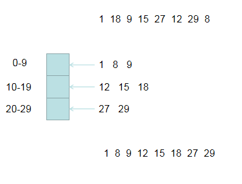
</div>


#基数排序
